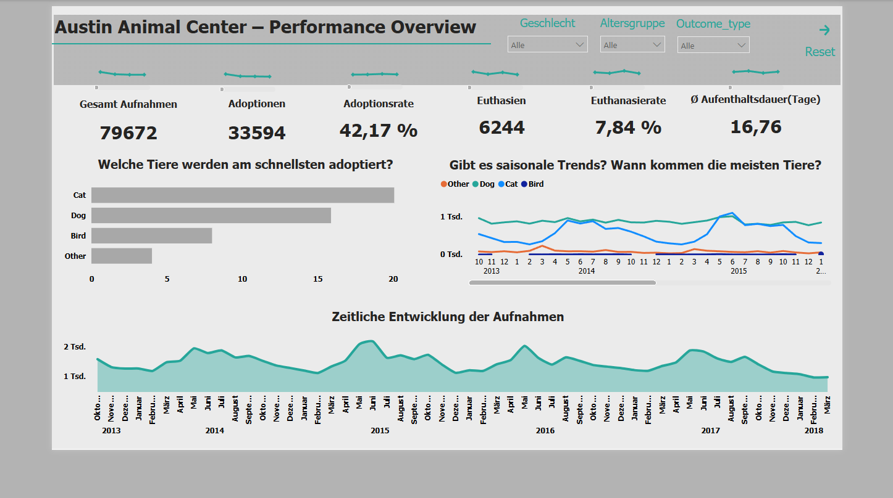

# Austin Animal Center Data Analysis

## Power BI Dashboard

## Project Overview
This project analyzes data from the Austin Animal Center to understand trends in animal intake, adoption, and shelter outcomes.

The goal is to explore patterns in animal shelter data and provide insights that could help improve adoption rates and shelter management.

---

## Dataset
The dataset contains information about animals entering and leaving the Austin Animal Center.

Key variables include:
- Animal type
- Breed
- Age
- Intake type
- Outcome type
- Date of intake and outcome

---

## Tools & Technologies
- Power BI
- Data Visualization
- Exploratory Data Analysis (EDA)

---

## Analysis Objectives
The project focuses on answering the following questions:

- What types of animals are most frequently admitted to the shelter?
- Which animals are adopted most often?
- Are there seasonal patterns in animal intake or adoption?
- How long do animals typically stay in the shelter?

---

## Dashboard
The Power BI dashboard visualizes key metrics such as:

- Number of animals by type
- Adoption rates
- Intake trends over time
- Outcome distribution

Example visualization:

---

## Key Insights
Some insights from the analysis include:

- Dogs and cats represent the majority of shelter intakes.
- Adoption is the most common outcome for many animals.
- Certain periods show higher intake rates.
- Understanding these trends can help improve shelter operations.

---

## Repository Structure
